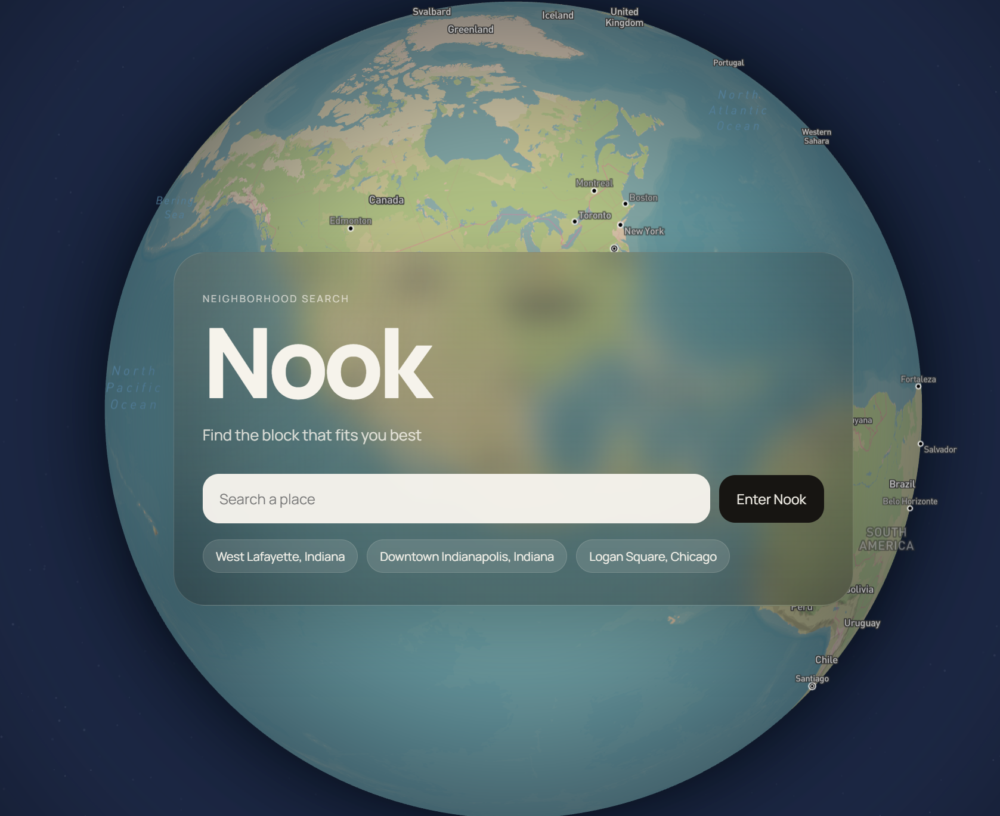
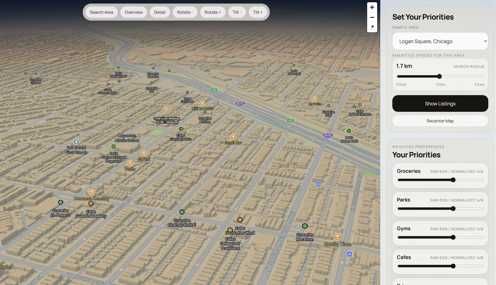

<p align="center">
  
  
</p>

# Nook

Nook is a React + Mapbox prototype for comparing rental listings against nearby neighborhood services (POIs) from OpenStreetMap via Overpass.

More information on devpost: https://devpost.com/software/nook-d0fl7g?ref_content=user-portfolio&ref_feature=in_progress

Apartment finders focus on immediate apartment specifications, but not the surrounding environment. As college students (as well as interns, new grads, new parents), we just want minimal apartment specifications for minimal price, where we really care about the surrounding amenities and surrounding environment - what services we can easily access, either by foot or by mobile.

Not only this, surroundings are also very important for families as well.

With the current housing crisis (rising housing prices), finding a good housing or apartment is harder than ever. that's why we built nook

The app combines:

- Sample regions as search presets
- Hardcoded rental listings per region
- Live POI fetching for service categories
- Preference-weighted ranking of listings

## Current Experience

### Landing

- Full-screen globe view (`globe` projection)
- Slightly zoomed-in globe with idle spin
- Search-like entry UI backed by sample region suggestions

### Exploration

- 3D neighborhood map (`mercator` projection)
- Search radius visualization (center point + ring)
- Listing points and active listing highlight
- POI points and labels by service category
- Lighting/time-of-day slider

### Results Mode

- Ranked listing list in the sidebar
- Mini listing cards rendered over each listing on the map
- Floating top map controls for:
  - Search area reset
  - Overview/detail zoom
  - Rotate left/right
  - Tilt down/up
  - 3D cinematic view

## Ranking Model (Prototype)

Listings are scored using normalized user preferences:

- Service-category importance weights
- Price importance weight
- Preferred monthly rent target
- POI proximity/access metrics (within a matching radius)

The current matching radius for listing-to-POI scoring is defined in code as:

- `LISTING_MATCH_RADIUS_METERS = 1200` in `src/App.jsx`

## Tech Stack

- React 19
- Vite 8
- Mapbox GL JS
- OpenStreetMap Overpass API

## Quick Start

1. Install dependencies:

```bash
npm install
```

2. Create `.env.local` in the project root:

```env
VITE_MAPBOX_TOKEN=pk.your_mapbox_public_token_here
```

3. Run the app:

```bash
npm run dev
```

4. Open the local Vite URL shown in the terminal (typically `http://localhost:5173`).

## Scripts

- `npm run dev` starts the Vite dev server
- `npm run build` builds for production
- `npm run preview` previews the production build locally
- `npm run lint` runs ESLint

## Project Structure

- `src/App.jsx` app state orchestration, search flow, ranking integration
- `src/components/MapView.jsx` Mapbox setup, map layers, camera controls, landing globe, listing mini-cards
- `src/components/Sidebar.jsx` setup/results UI, preference sliders, ranked list
- `src/data/fakeListings.js` sample rental listing dataset (GeoJSON features)
- `src/data/sampleRegions.js` sample searchable regions and default camera settings
- `src/data/serviceCategories.js` POI category definitions and defaults
- `src/lib/overpass.js` Overpass query construction + OSM normalization
- `src/lib/ranking.js` preference normalization and listing ranking logic
- `src/lib/geo.js` distance and geometry helpers

## Data and API Notes

- POIs are fetched live at runtime from Overpass.
- Listings are currently static sample data.
- Region search is currently matched against local sample region names, not geocoding.

## Troubleshooting

- If the map does not render, verify `VITE_MAPBOX_TOKEN` in `.env.local` and restart the dev server.
- If POIs fail to load, Overpass may be rate-limited or temporarily unavailable; retry shortly.
- If UI changes do not appear during development, hard-refresh the browser to clear stale assets.
